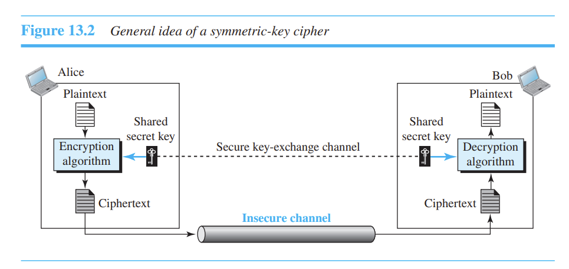
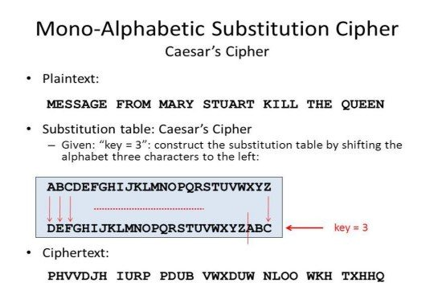
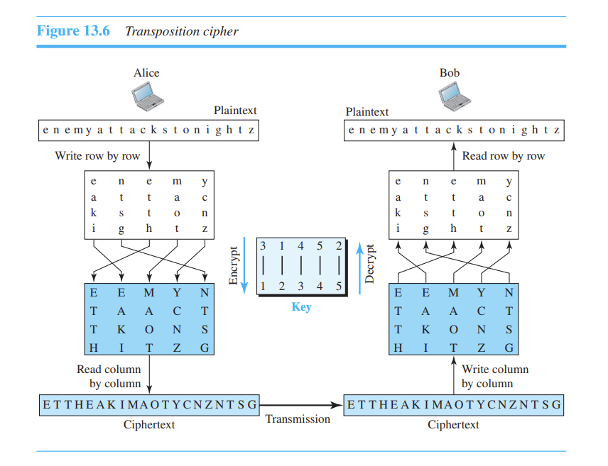
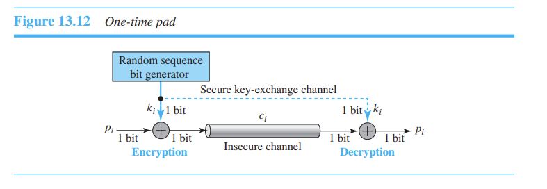
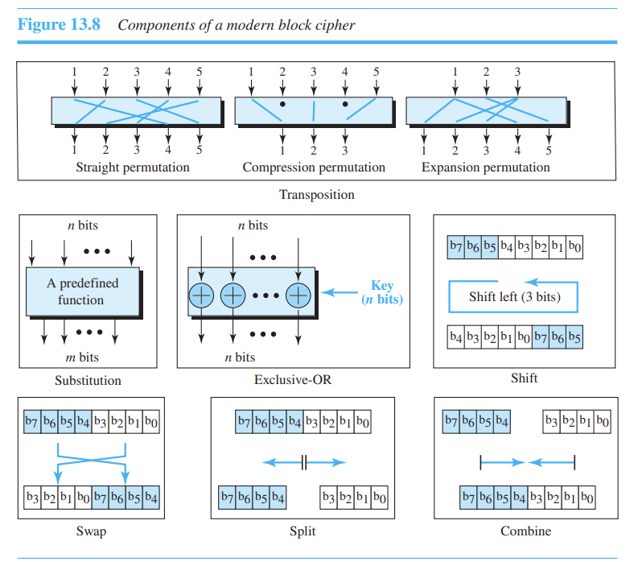
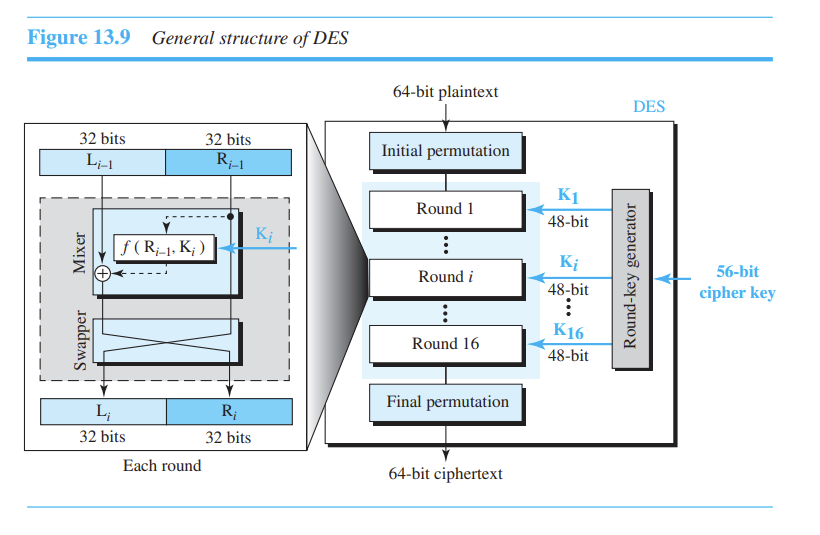
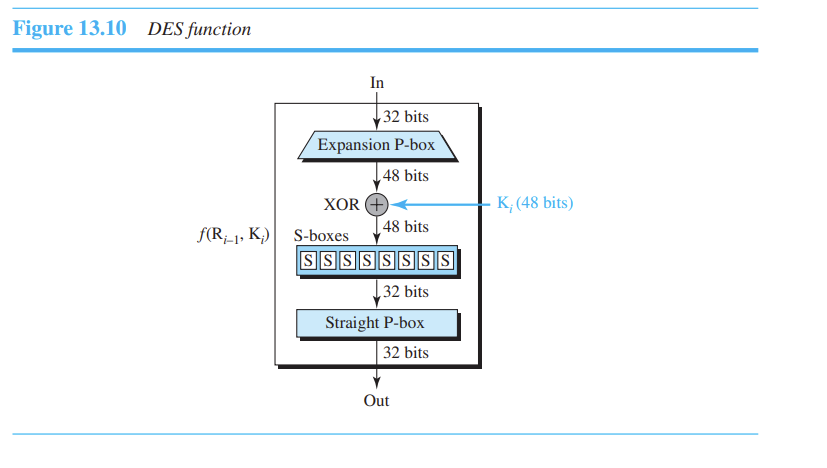
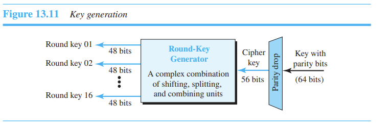

# Cryptography

부족한 부분은 추가적인 학습 이후에 정보를 채울 예정이다.

### Security Goals(보안의 3요소)

1. **Confidentiality [기밀성]**
   정보를 보관하는 목적 + 정보의 전달에도 적용된다.
   대표적인 공격 기법

   1. Snooping(스푸핑) : 허가되지 않은 데이터를 탈취
   2. Traffic Analysis : 정보의 내용을 직접적으로 들여다 보지 않고 트래픽을 분석해서 해당 정보를 예상하는 것.
      Ex) 함참의 통신량이 엄청나게 증가했다 -> 군사적인 문제

2. **Integrity [무결성]**
   변하지 않는 것. 예를 들어서 당신이 은행에 100만원을 예금하고 다음 날 동일한 금액을 찾으려고 갔지만 은행에서는 10만원 밖에 예금된 것이 없다고 한다면? 무결성이 지켜지지 않은 것이다.
   대표적인 공격 기법
   1. Modification
   2. Masquerading = Snoofing 그 사람인 척 가면을 쓰는 것
   3. Replaying
   4. Repudation (내가 안했는데?? 부인하는 것)
3. **Availability [가용성]**
   생성하고 저장된 정보를 권한이 있는 기관에서 사용할 수 있는 것.
   은행에 가입을 했는데 은행에서 해당 고객의 정보를 사용하지 못하면?
   대표적인 공격 기법
   1. Dos

보안의 3요소를 지켜내기 위한 / 공격을 막지 위해 Cryptography 와 Steganography라는 기술이 현대까지 사용되고 있다.

### Steganography

기원 : 그리스 "Coverd Writing" 비밀메시지라고 알면된다. 아래 링크를 통해 실습까지 진행해보자
https://m.blog.naver.com/kgu3405/221383577939

---

이제 3요소 중에서 Confidentiality
[이미지 출처] : Behrouz A. Forouzan - Data Communications and Networking with TCP_IP Protocol Suite-McGraw-Hill (2022)

## Symmetric-Key Ciphers 비공개 키 암호 방식

비공개 키 암호 방식은 한개의 키를 공유하고 있으며 이를 통해 암호화/복호화 작업을 진행한다.
-> 비밀번호를 공유해야 한다 [단점] 그럼에도 불구하고 효율성 떄문에 아직 사용한다.

- Subsitution Ciphers
  대체 암호 방속 : A->D, T->Z 이런식으로 암호화/복호화 진행

- Monoalphabetic Ciphers
  Additive Ciphers = Shift Ciphers [줄리어스 시저가 고안] => Caesar cipher
  
  [https://www.researchgate.net/figure/Mono-Alphabetic-Substitution-Cipher_fig2_323081658]

- Polyalphabetic Cipher [비제네르 암호방식]
  [https://ko.wikipedia.org/wiki/%EB%B9%84%EC%A6%88%EB%84%A4%EB%A5%B4_%EC%95%94%ED%98%B8] 위키 참고

- Transposition Cipher
  글자 섞기 -> 순서 변경 [1 2 3 4 -> 2 4 1 3]
  

- Stream Ciphers : 암호화/복호화가 한번에 연속해서

- -> 현대 스트림 암호방식 : **one-time pad**
  데이터를 계속 보내면서 암호화 시키는 것
  
  암호화/복호화 알고리즘 각각 단일 XOR 연산을 사용한다. 암호화/복호화 알고리즘은 XOR 연산의 속성에 따라 서로 반대이다. 중요한 점은 이 연산이 한 번에 1 bit씩 사용한다는 것이고, Secure Channel이 있어서 목적지한테 key stream sequence를 보낼 수 있다는 것이다.
  ideal cipher라고 표현을 함. 추측이 불가하다 = plaintext에 패턴이 있더라도 ciphertexr가 진짜로 random stream of bits로 되어 있다는 것이다. 이걸 뚫으라면 평문이 $n$bits일 때 $2^n$만큼 시도를 해야한다.
  문제점? 발신자와 수신자가 통신할 때마다 키를 공유해야 하는데 매번 랜덤인 녀석을 계속? 이는 매우 어렵다고 생각되어서 차선책으로 나온 녀석이 FSR(Feedback Shift Register)이라고 한다.

- Block Ciphers
  블록 단위로 행해지는 방식 사진을 보면 알겠지만, 이런 다양한 방식들을 통해서 암호화를 한다.
  

- DES(Data Encrytion Standard)
  현대의 block Cipher의 예시. 64-bit 블록의 대칭키 암호방식을 쓰는 녀석
  
  최종 순열은 초기 순열의 역순이다. rounds가 구조에서 제거된다면 암호문은 평문과 동일해진다.
  *Rounds*에 대한 설명은 옆에 그림을 보고 이해하자. 총 16개의 Round가 사용되고, 각각의 round는 가역변환이다. 스와퍼는 문자의 왼쪽과 오른쪽 반반 교체시킨다. mixer는 XOR 연산 구조를 가지고 있어 가역이고, 불가역은 애들은 $f (R_{i-1}, K_i)$ 여기 저장된다.

- **-> DES Function**
  이녀석이 DES의 심장 역할을 하는 핵심 기능이다.
  
  DES 기능은 48bits를 가장 오른쪽 32 bits에 적용해서 32bits를 출력을 생성하는데, 이 과정은 4가지로 구성되어 있다. 그림에서 보이는 P-box 2개,S-box를 빼고 whitener(키를 추가하는 것)으로 구성되어 있다고 한다.
  왜냐하면 $R_{i-1}$은 32-bit의 입력으로 되어 있고 $k_i$는 48-bit의 키이기 때문에, 처음에 $R_{i-1}$을 48bits로 확장시키는 것이 필요하기 떄문이다.
  이 순열의 확장은 정해둔 규칙에 따른다. 확장된 뒤, DES는 XOR 연산을 확장된 오른쪽 구역과 round key에 사용한다. S-boxes는 실제로 mix를 해주고 DES가 각각 6-bit의 입력과 4-bit의 출력을 하는 8개의 S-box를 사용한다.
  마지막으로 작동하는 녀석은 32-bit의 입력과 32-bit의 출력을 가진 Straight Permutation이다.

- -> Round Key Generator
  56-bit cipher key에서 16개의 48-bit 키를 생성한다고 한다. 그러나, 암호키는 보통 extra 8bits와 패리티 비트로 된 64-bit의 키로 주어지기에 실제 key-generation process가 일어나기 전에 drop 된다.
  

  Session Key를 사용해서 일회성 키 생성
  송수진자의 키를 따로 사용하는 것이 좋다
